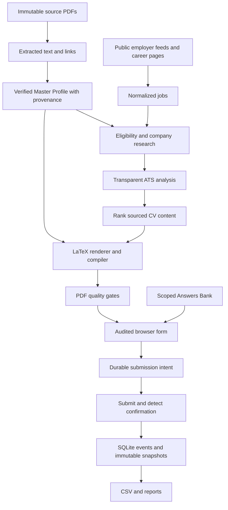

# Architecture

WORKAI uses explicit knowledge and state boundaries. Candidate facts, employer requirements, and application events are different records; no information flows from a job requirement into a candidate claim without evidence.

## Modules and specialist responsibilities

`profile.py` handles source preservation, extraction, normalization, missing information and evidence validation. `cv.py` performs deterministic relevance ranking, safe LaTeX escaping, immutable versioning, compilation and PDF checks. `jobs.py` owns adapter-based discovery, normalization, keyword extraction, eligibility, alignment and sourced company research. `answers.py` owns semantic aliases, scoped approval, salary handling, usage and revision history. `browser.py` executes audited form mappings and positive confirmation gates. `profile_sync.py` completes known missing profile fields and records conflicts. `store.py` owns normalized persistent entities, lifecycle transitions, deduplication, append-only events and CSV projection. `orchestrator.py` connects stages, handles per-job errors, snapshots exact artifacts and resumes safe work. `security.py` owns private atomic writes, secret redaction and tracked-file audits. `reporting.py` derives operational counts and possible skill gaps. `agents.py` maps all 18 requested specialized responsibilities to executable targets; these are bounded components, not an assertion that 18 language-model processes are running.

## Canonical data

Candidate profile is YAML with inline and JSON-pointer evidence, backed by untouched source hashes. Date precision remains as supplied; month-only dates must not become exact dates. Skills are only those explicitly supported in source sections/projects/roles. Legal answers require country scope. Overlapping employment must not be double-counted into experience claims.

SQLite normalizes Candidate, Company, Job, Application, CVVersion, ATSAnalysis, Question, Answer, PlatformProfile, ResearchRecord and ApplicationEvent. JSON columns retain complete source records while IDs and foreign keys establish relationships. WAL and immediate transactions serialize claims. Event and answer history cannot be updated/deleted through normal SQL; all supported operations preserve history. Runtime data is excluded from source control.

## State, idempotency and recovery

The preparation sequence is DISCOVERED → ANALYZED → QUALIFIED → RESEARCHED → TAILORED → CV_GENERATED → CV_VALIDATED → READY_TO_APPLY. Incompatible jobs become EXCLUDED; missing mandatory facts become BLOCKED_UNKNOWN_FIELDS. Submission proceeds through APPLICATION_STARTED → SUBMISSION_INTENT → SUBMITTED only when a positive receipt is detected. INTERVIEW, REJECTED and WITHDRAWN are later outcomes.

One application exists per normalized job. Canonical URLs strip tracking parameters but retain job identifiers. Cross-platform company/role/location matches are treated as possible duplicates conservatively. The runner lock excludes simultaneous submitters, and database transactions protect concurrent claims.

A crash during form entry or submission becomes RECONCILIATION_REQUIRED. It cannot retry until recorded platform evidence proves submission or non-submission. The latter permits a retry; the former records the receipt. Unknowns/config blocks retry after meaningful knowledge changes. Preparation errors retry only within explicit bounds. Historical CV versions and sealed attempt results remain unchanged; current CSV can be regenerated from the database at any time.

## External content and automation boundary

Public job APIs provide employer claims and provenance, not instructions. Job URLs may not choose executable code, adapter definitions, answers, or CV file paths. Trusted local configuration defines allowed hosts, form semantics, navigation and confirmation. A missing selector, unknown required control, auth/CAPTCHA challenge or unclear outcome fails closed. No broad platform is declared supported merely because a browser can open it.

## Measured versus planned

Baseline tailoring and matching are deterministic. This yields auditable source preservation but cannot fully understand arbitrary requirements, prose nuances, or all résumé layouts. General model-backed extraction/reasoning and additional platform adapters remain extensions subject to evidence gates. Real external application acceptance is separate from local browser fixtures. [docs/ACCEPTANCE.md](docs/ACCEPTANCE.md) records the latest actual evidence.
